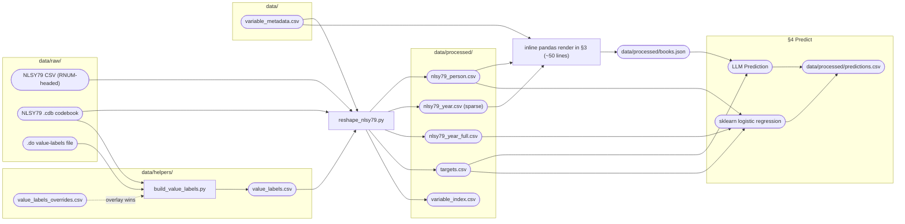
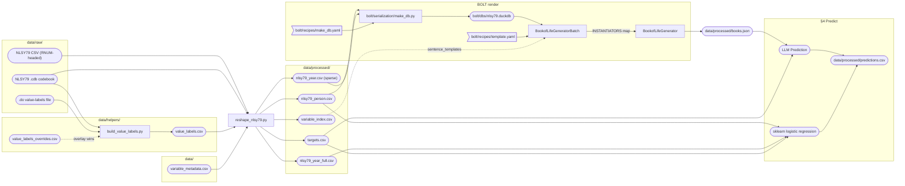
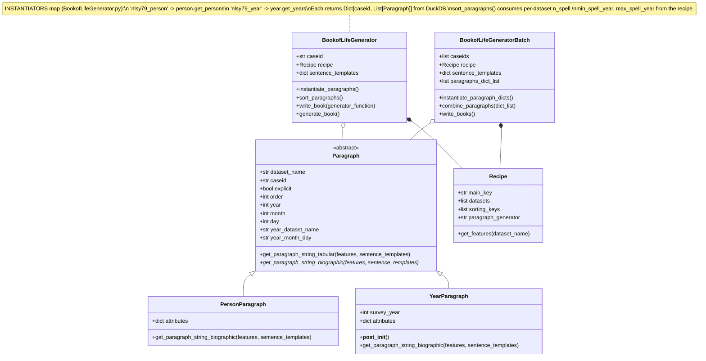

# Architecture

Two notebooks share the reshape + prediction halves; they differ only
in **how the Book of Life is rendered**.

- `bol_pipeline_simplified.ipynb` — pure pandas; reads the processed
  CSVs directly and writes `books.json`. No DuckDB, no recipes, no
  `Paragraph` classes.
- `bol_pipeline.ipynb` — BOLT framework: pandas CSVs → DuckDB →
  `BookofLifeGeneratorBatch` → `BookofLifeGenerator` → `books.json`.
  Recipe-YAML-driven; `Paragraph` subclasses for new datasets.

Both write the same `data/processed/books.json` shape, so the §4
prediction + metrics code is shared. The class diagram below only
documents the BOLT path.

For "what file to edit when…" see [README.md → What to edit when](README.md#what-to-edit-when).

## Pipeline — `bol_pipeline_simplified.ipynb` (pandas only)

## Pipeline — `bol_pipeline.ipynb` (BOLT framework)

## Class diagram — BOLT path

Only relevant for `bol_pipeline.ipynb`. The simplified notebook uses a short pandas code block.

